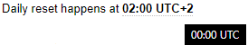

# auto-time
Automatically convert timestamps into the users timezone.

```html
<p>Daily reset happens at <span data-auto-time="1569369600"></span></p>
<script src="auto-time.js"></script>
```


**On cursor hover:** <br>

